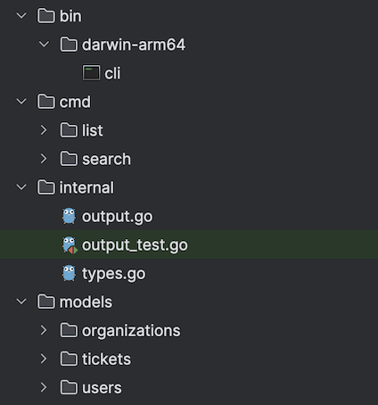

# Zendesk Challenge - Search CLI


### System Requirements
- Go / Golang version `1.21`
- `make` utility - install with `brew install make` on MacOS.
- Environment variables for correct usage of go are set, such as `GOROOT`, `GOPATH` and `GO111MODULE=on` (default)
- Tested on `Mac Sonoma M1`. Should work fine with any `darwin-arm64` architecture.

### Usage Instructions
- Open command line in root directory of this repo.
- Run `make build` - this will generate the cli as a binary in `bin/darwin-arm64`
- Then run `make setup`, this will move the `cli` executable to current directory
- To make it easier, a copy of `cli` executable is left in the root directory, for being able to run directly.


#### Listing searchable fields
- Run `./cli list` for getting all possible searchable fields

#### Searching
- Searching can be done via `./cli search` command. Type `--help` to see usage
- To search for empty fields, don't specify `--value` flag, as the CLI then treats it as empty string (**NOTE**: be careful they are empty strings, for values that require integers, it will still display error message, saying you need to specify int value, as empty value cannot be int)
- Eg: `./cli search user --name _id --value 1` searches for user with `_id` attribute as `1`, shows output (**NOTE**: list values are displayed individually by index):
```
======== All results ========
------------------------------------------------
tags_0: Springville
tags_1: Sutton
tags_2: Hartsville/Hartley
tags_3: Diaperville
verified: true
created_at: 2016-04-15T05:19:46 -10:00
external_id: 74341f74-9c79-49d5-9611-87ef9b6eb75f
name: Francisca Rasmussen
last_login_at: 2013-08-04T01:03:27 -10:00
email: coffeyrasmussen@flotonic.com
_id: 1
suspended: true
shared: false
role: admin
organization_name: Multron
alias: Miss Coffey
active: true
timezone: Sri Lanka
organization_id: 119
locale: en-AU
phone: 8335-422-718
signature: Don't Worry Be Happy!
tickets_0: Ipsum reprehenderit non ea officia labore aute. Qui sit aliquip ipsum nostrud anim qui pariatur ut anim aliqua non aliqua.
tickets_1: Nostrud veniam eiusmod reprehenderit adipisicing proident aliquip. Deserunt irure deserunt ea nulla cillum ad.
```

#### Gotchas / Catches
1. ***Searching for list based items (`tags`, `domain_names` etc.)***
   1. These are searchable by specifying one single value only, not a list of values. Eg. if you want to search users, where one of the tags is `abc` you would run the command: `./cli search user --name tags --value abc`
2. ***Specifying values with spaces***:
   1. These need to be enclosed with double quotes like:
      `./cli search user --name tags --value "abc def"` if the tag you are searching for is called `abc def` 
3. ***Specifying boolean values***
   1. Searching for boolean values works in a few ways, the value can be:
      1. True values: `1`, `t`, `T`, `TRUE`, `true`, `True` 
      2. False values: `0`, `f`, `F`, `FALSE`, `false`, `False`
   2. Example in the following command the value being searched for is `false`, and can be modified to use either one of `0`, `f`, `F`, `FALSE`, `False` as well: `./cli search user --name suspended --value false`. Same goes for `true` value as well.

### Testing Instructions
All features (CLI, models, search evaluation/processing, internal utilities) have been thoroughly tested.  All tests are defined within the individual packages themselves. To run tests follow these steps:

1. Run `make test`
2. For test coverage, run `make coverage`, see output below:
```
go tool cover -func profile.cov
ZendeskChallenge/cmd/list/handler.go:14:                        NewListCmd                      100.0%
ZendeskChallenge/cmd/list/list.go:15:                           fieldList                       100.0%
ZendeskChallenge/cmd/search/handler.go:14:                      NewSearchCmd                    100.0%
ZendeskChallenge/cmd/search/handler.go:27:                      NewUserSearchCmd                100.0%
ZendeskChallenge/cmd/search/handler.go:42:                      NewTicketSearchCmd              100.0%
ZendeskChallenge/cmd/search/handler.go:57:                      NewOrgSearchCmd                 100.0%
ZendeskChallenge/cmd/search/process.go:25:                      addRelatedUserEntities          100.0%
ZendeskChallenge/cmd/search/process.go:63:                      addRelatedTicketEntities        100.0%
ZendeskChallenge/cmd/search/process.go:105:                     evaluateSearch                  90.9%
ZendeskChallenge/cmd/search/process.go:125:                     evaluateSearchResultByDataType  85.7%
ZendeskChallenge/cmd/search/process.go:178:                     parseRawDataByType              100.0%
ZendeskChallenge/cmd/search/search.go:33:                       getFileData                     100.0%
ZendeskChallenge/cmd/search/search.go:48:                       triggerUserSearch               77.3%
ZendeskChallenge/cmd/search/search.go:90:                       triggerTicketSearch             77.3%
ZendeskChallenge/cmd/search/search.go:132:                      triggerOrgSearch                72.2%
ZendeskChallenge/internal/output.go:15:                         DisplayResults                  100.0%
ZendeskChallenge/models/organizations/organizations.go:29:      FetchName                       100.0%
ZendeskChallenge/models/organizations/organizations.go:33:      FetchValue                      100.0%
ZendeskChallenge/models/organizations/organizations.go:55:      FetchFiltered                   100.0%
ZendeskChallenge/models/organizations/organizations.go:60:      SetFiltered                     85.7%
ZendeskChallenge/models/organizations/organizations.go:72:      FetchProcessed                  100.0%
ZendeskChallenge/models/organizations/organizations.go:81:      FetchRaw                        100.0%
ZendeskChallenge/models/organizations/organizations.go:86:      Fetch                           100.0%
ZendeskChallenge/models/tickets/tickets.go:61:                  FetchName                       100.0%
ZendeskChallenge/models/tickets/tickets.go:65:                  FetchValue                      100.0%
ZendeskChallenge/models/tickets/tickets.go:70:                  SetFiltered                     85.7%
ZendeskChallenge/models/tickets/tickets.go:82:                  FetchFiltered                   100.0%
ZendeskChallenge/models/tickets/tickets.go:87:                  FetchProcessed                  100.0%
ZendeskChallenge/models/tickets/tickets.go:96:                  FetchRaw                        100.0%
ZendeskChallenge/models/tickets/tickets.go:101:                 Fetch                           100.0%
ZendeskChallenge/models/users/users.go:70:                      FetchName                       100.0%
ZendeskChallenge/models/users/users.go:74:                      FetchValue                      100.0%
ZendeskChallenge/models/users/users.go:79:                      SetFiltered                     85.7%
ZendeskChallenge/models/users/users.go:91:                      FetchFiltered                   100.0%
ZendeskChallenge/models/users/users.go:96:                      FetchProcessed                  100.0%
ZendeskChallenge/models/users/users.go:105:                     FetchRaw                        100.0%
ZendeskChallenge/models/users/users.go:110:                     Fetch                           100.0%
total:                                                          (statements)                    91.3%
```

### Design tradeoffs
#### Building CLI Interface
- [`cobra`](https://github.com/spf13/cobra) was used for developing go based CLI , due to its conciseness, ease of testability and development speed.

#### Searching through JSON
1. For searching through JSON efficiently, `JSONPath` query language (similar to `XPath` for XML) was used. It is quite efficient, and more about it can be read [here](https://goessner.net/articles/JsonPath/), it follows `Goessner` based implementation. Some other benefits being keeping the code simpler, it also allows complex arithmetic operations (like `OR` and `AND` , `gt`, `lt`, etc. such as comparing if element exists in list or not by comparing to `-1` (which is O(1) lookup) and also supports searching list based key-value pairs) - which makes it a great fit for parsing large amounts of JSON efficiently, and getting what we need.
   1. Other possible considerations were converting whole data model to `Trie` and then searching through it, which would still not be as efficient, due to the fact that user input can be one of many fields, making Trie have too many options and hence not the most optimal. This becomes even more complex when searching for values which are list-format (`key=[. . . ]`, i.e. value is a list)
   2. `JSONPath` parser in go is used from [ojq](https://github.com/ohler55/ojg) installable as `go` module.
      1. Similar to `XPath` it relies on a tree representation of document, making it much quicker to locate certain items and jump straight to them (than say storing them as a list and performing sorting / searching operations like binary search would.)
2. This query language is designed for keeping memory overhead small, and searches efficient, without linear increase in time (as JSON is converted to native objects which provide quicker lookup) as more data is added.
3. Also to avoid memory saturation, JSON is loaded once for subsequent parsing again and again, rather than load JSON everytime you need it (for getting related entities, for retrieving data again etc.)
4. Specific queries were formulated, which can be seen in `cmd/search/process.go` to find entries in JSON that match what we are looking for (item in list, or key equals value where value can be of various types like bool/string/integer etc.)

#### Adding related entities
1. When searching for users
   1. All ticket descriptions of tickets that this user has submitted, are shown
   2. Name of organization is shown

2. When searching for tickets
   1. Assignee name and submitter name is shown
   2. Organization name is shown

#### Package structure
1. Packages have been divided as follows for proper separation of concerns, extensibility and testing
   1. `cmd` - For defining all CLI commands
      1. `list` - For handling list command
      2. `search` - For handling search command, and related interfaces and processing
   2. `internal` - For generic methods / interfaces used throughout the application
   3. `models` - For defining the entities and their structures, to operate and process, ability to define separately and extend as needed.



